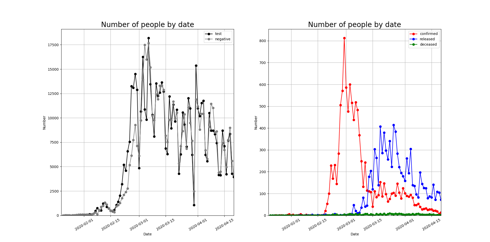
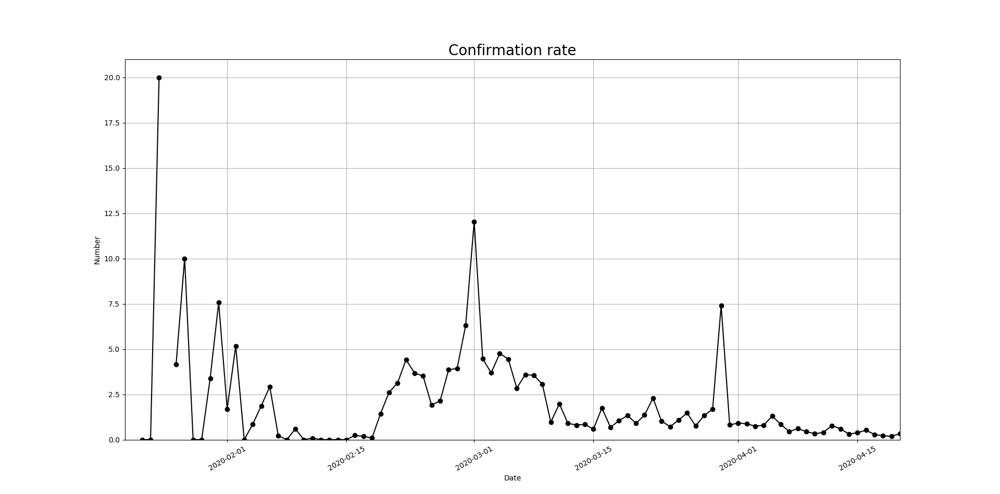
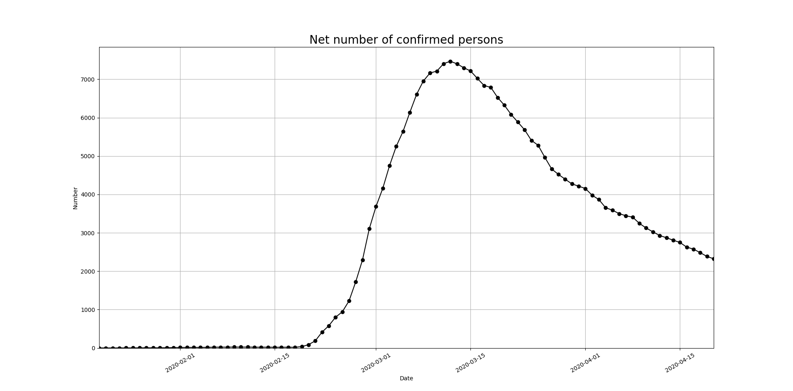
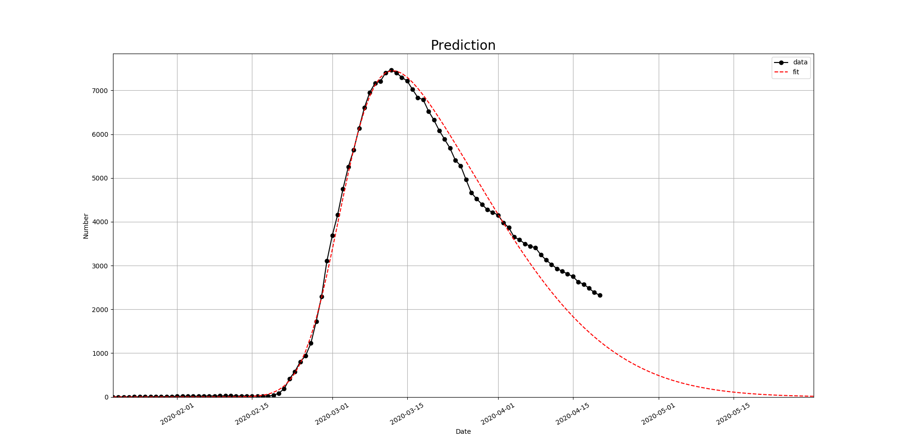
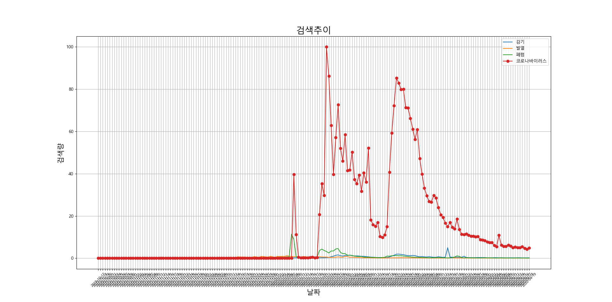
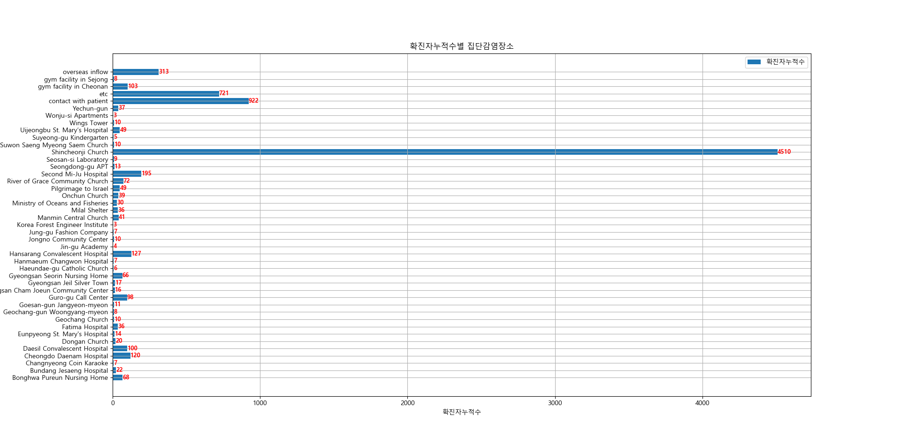
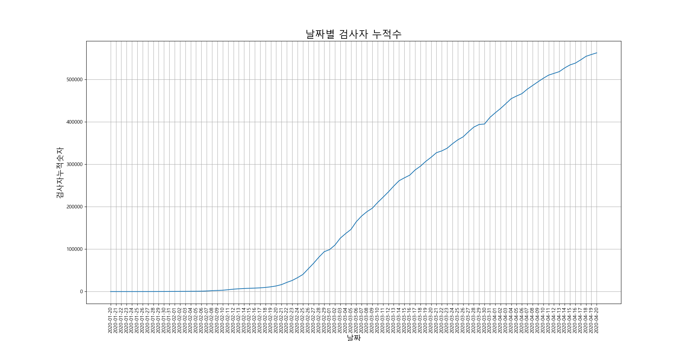
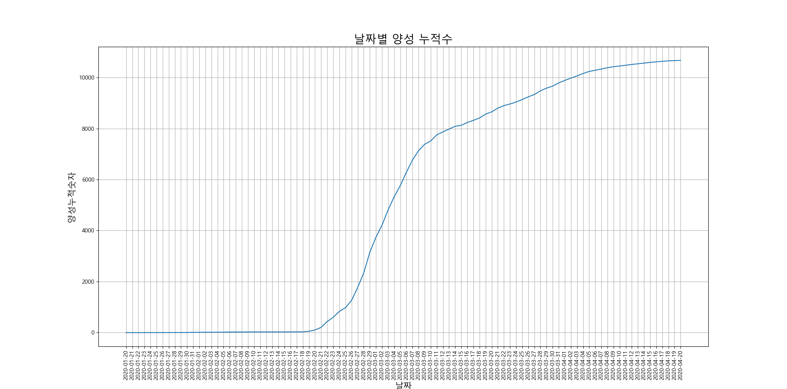
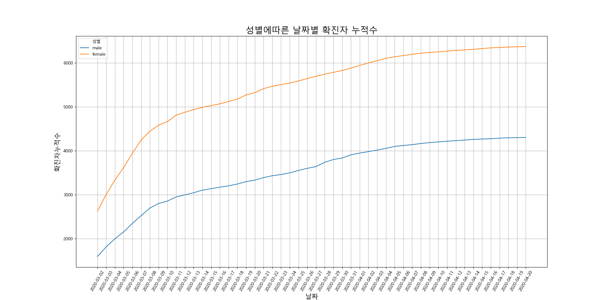

# COVID-19

## 개요

2019년 12월 중국 우한에서 처음 발생한 이후 중국 전역과 전 세계로 확산된, 새로운 유형의 코로나바이러스(SARS-CoV-2)에 의한 호흡기 감염질환이다. 코로나바이러스감염증-19는 감염자의 비말(침방울)이 호흡기나 눈·코·입의 점막으로 침투될 때 전염된다. 감염되면 약 2~14일(추정)의 잠복기를 거친 뒤 발열(37.5도) 및 기침이나 호흡곤란 등 호흡기 증상, 폐렴이 주증상으로 나타나지만 무증상 감염 사례도 드물게 나오고 있다.
특히나 전세계적으로 유행하며 확산및 감소하는 추세에 데이터를 구할수있어서 시각화를 시도한다.

## 데이터출처&License
[dacon](https://dacon.io/competitions/official/235590/overview/)

CC BY-NC-SA 4.0

## requirements
* pip install -r requirements.txt

## Path
* arg[1] : __data folder (Users\COVID-19\data)__

### VIS 안 html 파일 저장

# Report
## Time
### 누적그래프
* test,negative,confirmed,released,deceased 의 전체 양상 비교를 위해 숫자에 +1 이후 로그를 취한값을 비교하였다.

* ).png)

* 위의 그래프의 특정적인 지점은 __2020-02-18 부터 확진자 및 사망가 급증__, __누적격리수의 경우 2020-03-05 부터 소량 증가__ 함이 보인다.

### 일별그래프
* 누적결과로부터 일별검사,음성결과,양성결과,격리해재,사망수치를 구하였다.

* 

### 테스트당 확진 비율 (확진율)
* 확진율 = 확진자 수/ 검사수 X 100

* 

* 전체    : 2.5645 %
* 최근 2주        : 2.1224 %

### 순수 확진자수
1. 순수확진자수는 누적확진자수에서 격리해제수와 사망자수를 제한한값
2. 순수확진자수 = 확진자수 - 격리해제수 - 사망자수

* 

### 순수 확진자수 예측
* 순수확진자수의 추세를 알아보기위해 Skew normal distribution 을 이용
* 

### 결론
* 2020-02-18 부터 확진자가 급증
* 순수확진자수는 감소추세
* Skew normal distribution 을 가정, 2020-04-20 이후 순수확진자수가 1000명 이하로 예상

## Vis
### 2020-01-01 이후를 기준으로 검색추이 그래프생성

* 
* 위의 이미지에서 2020-01-08 시점 코로나바이러스의 급증, 폐렴에 대한 검색량 증가가 나타남.
* 추가적으로 2020-01-22 시점 코로나바이러스 검색의 최고점을 달성

### 확진자 누적수별 집단 감염장소 그래프 생성
* 

* 위의 이미지에서 신천지교회가 압도적으로 높음을 알수있다.

### 날짜별 검사자누적수,음성누적수,양성누적수,완치누적수,사망누적수 그래프 생성
* 
* 
* 

* 위의 이미지에서 2020-02-22 시점 검사자의 증가가 본격적으로 시작된다.
* 양성판정자 마찬가지 2020-02-22 시점 양성판정자의 수의 증가가 본격적으로 시작된다.

### 날짜별 확진자 누적수(성별) 그래프 생성
* 
* 그래프로 보이는 양상은 여성이 남성보다 약 2000명정도 확진자 누적수가 많은것으로 판단된다.

### 날짜별 사망자 누적수(성별) 그래프 생성
 * 
* 확진자 누적수와는 반대의 양상을 보인다. 사망자누적수의 경우 남성이 여성보다 평균 7명정도 높게 나타났다.

