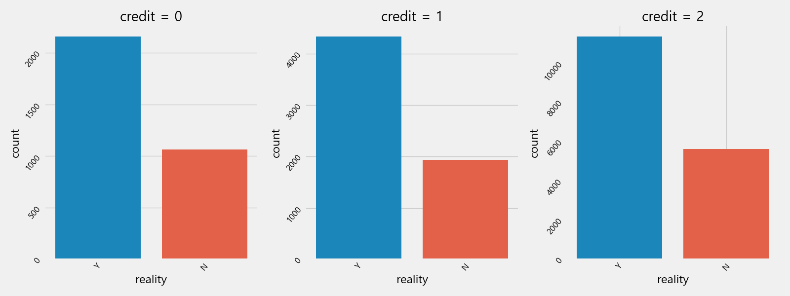
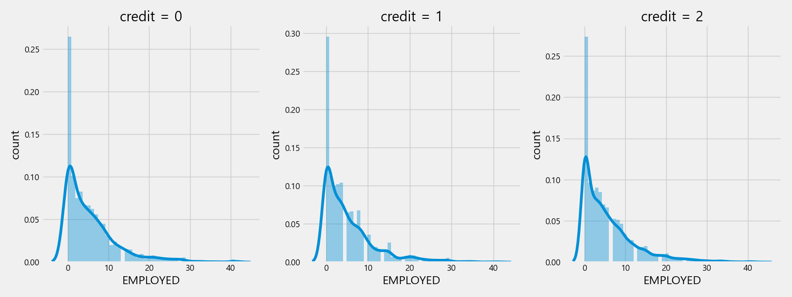

# Credit-card
## requirements
* pip install -r requirements.txt

## path
* EDA : User\data

## Variable

|divisoin|info|remarks|
|---|---|---|
|gender|성별|남여|
|car|차량|차량소유여부|
|reality|부동산|부동산소유여부|
|child_num|자녀수||
|income_total|연간소득||
|income_type|소득분류||
|edu_type|교육수준||
|family_type|결혼여부||
|house_type|생활방식||
|DAYS_BIRTH|출생일||
|DAYS_EMPLOYED|업무시작일|수집당시기준 역셈, -1은 하루전, 양수값은 고용되지않음|
|FLAG_MOBIL|핸드폰소유||
|work_phone|업무용전화소유||
|phone|전화소유||
|email|이메일소유||
|occyp_type|직업유형||
|family_size|가족규모||
|begin_month|신용카드발급월|수집당시기준 역셈|
|__credit__|신용도|사용자의 신용카드 대금 연체를 기준으로 신용도측정, 낮을수록 높은 신용의 신용카드 사용자를 의미|

## Report
* 결측치 확인

    OCCYD_type : 직업 유형 변수 의 결측치 존재
    

* 신용 등급 비율
    0 : 최하신용등급
    2 : 최고신용등급
    

* 신용 등급별 그래프
    * 성별 : 모든등급에서 남성이 약 2배 많음.
    
    * 부동산 : 모든등급에서 부동산 소유자가 더 많음
    
    * 소득분류 : 높은 신용도에서 학생은 존재하지 않고 낮은 신용도에서 학생 존재 -> 학생신분특성
    
    * 교육수준 : 차이없음
    
    * 결혼 : 모든등급에서 기혼자가 더 많음
    
    * 생활방식 : 차이없음
    
    * 핸드폰 : 차이없음
    
    * 차량소유 : 모든등급에서 차량 미보유자가 더 많음
    

* 신용등급별 직업유형
    * 변동이 조금씩 존재함
    

* 신용등급별 자녀수, 연간소득, 연령대, 직업, 가족 수
    * 자녀수 : 차이없음
    

    * 연간소득 : 큰 차이는 없어보임
    
    

    * 연령대 : 20~30대 비율이 낮음, 등급별 큰차이 없어보임
    

    * 직업 : 대체로 직업이 없는 사람이 많음
      

    * 가족 수 : 보통 2명으로 확인됨, 2등급은 1과 2에 비해 Family_size 최대값이 큰것으로 확인됨
    

* 등급별 카드 발급기간
    * 발급기간 : 대부분 10개월 이하.
    

TODO : 중복이슈가 많이 등장 -> 중복제거 EDA 고려